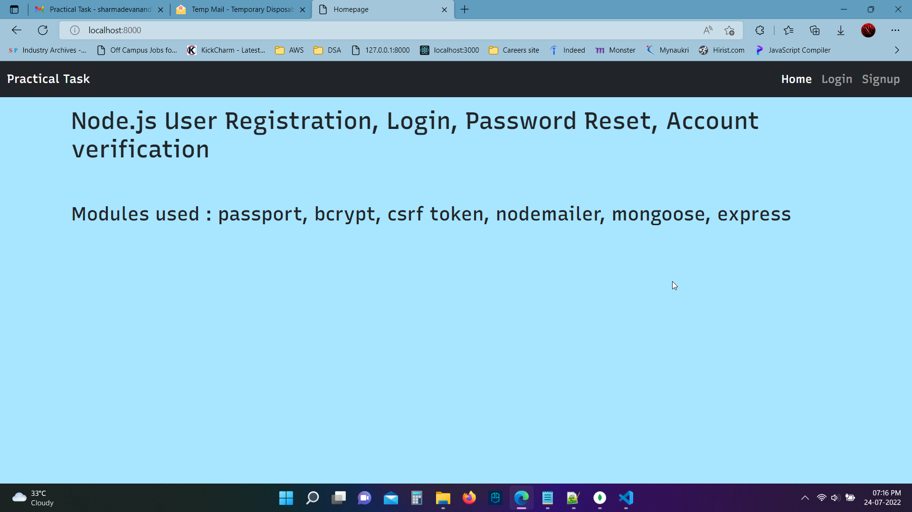
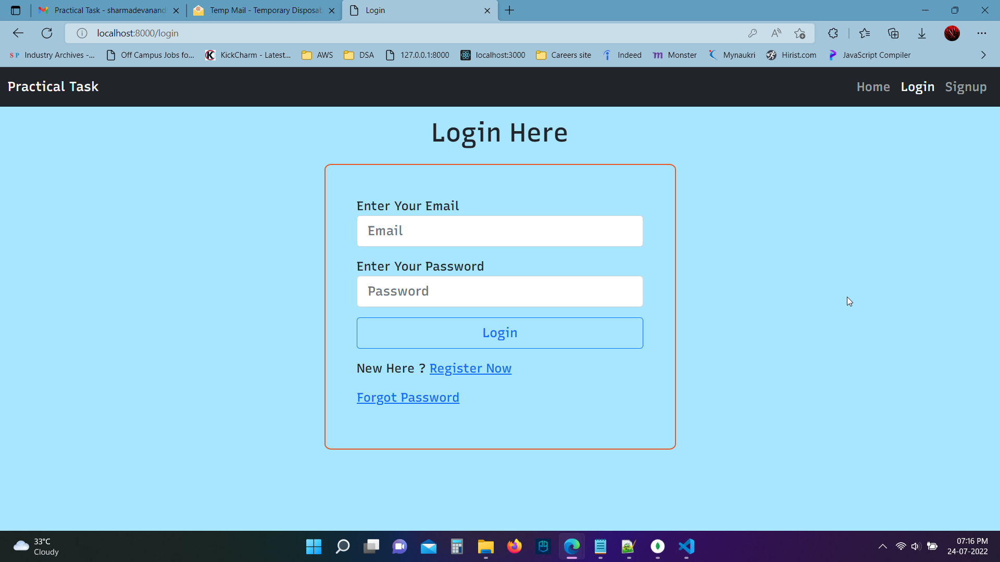
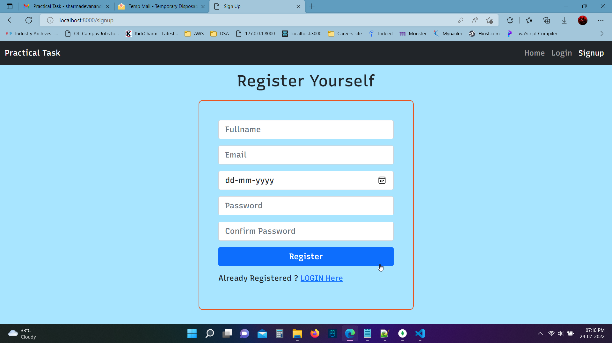
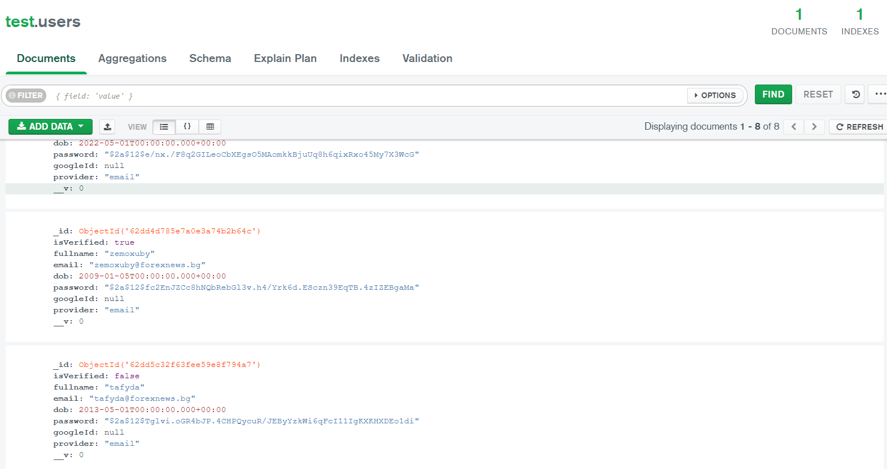
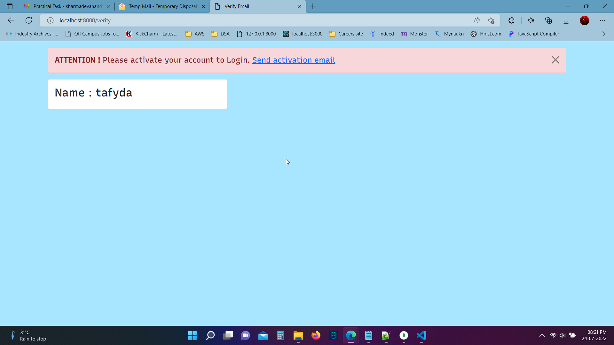
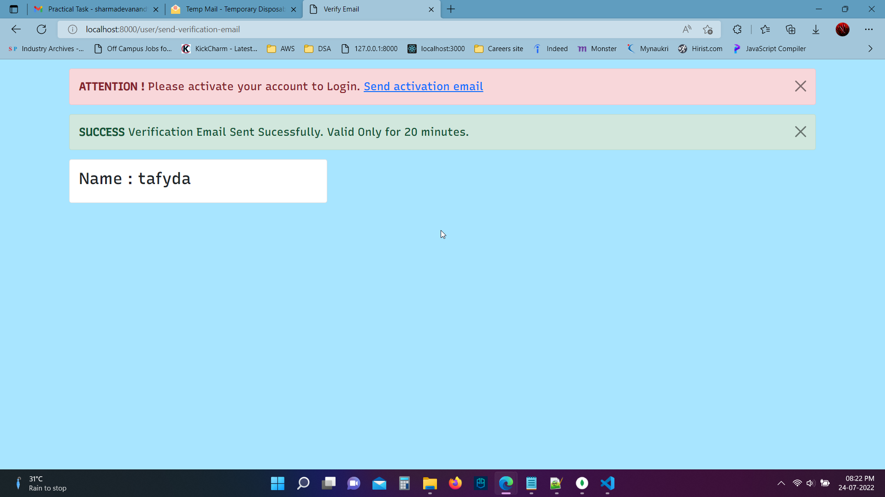
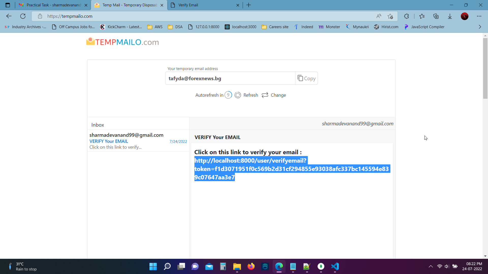
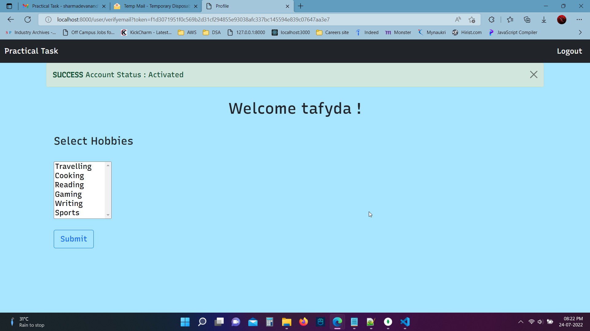
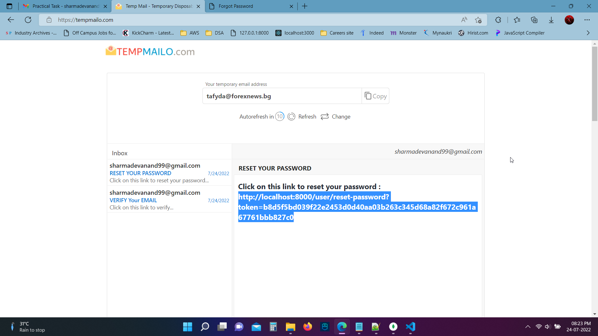
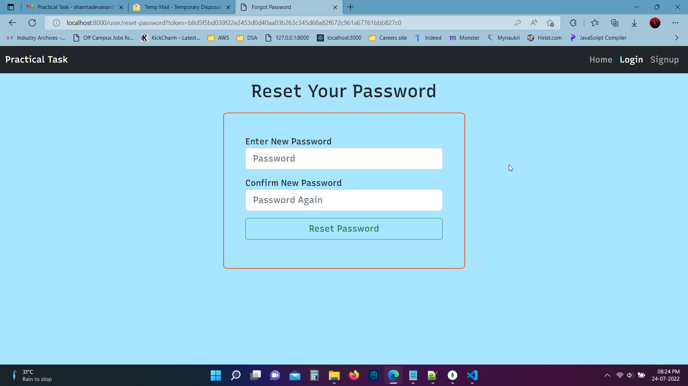

# Node Passport Authentication

## Registration, Login, Password Reset, Account verification
## Modules used : passport, bcrypt, csrf token, nodemailer, mongoose, express

### Add mongoURI ,Google client ID and Secret, smtp config for sending emails 

