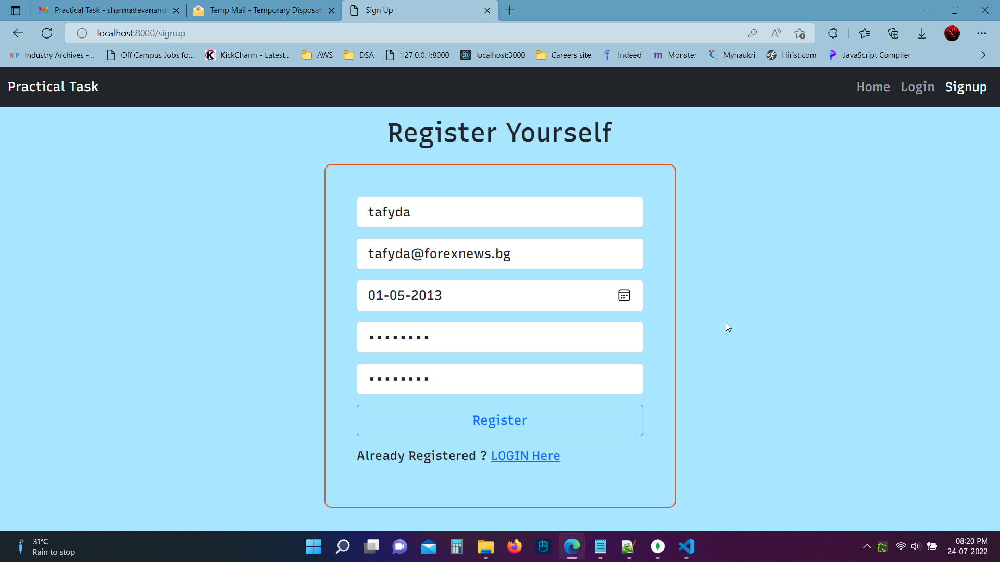
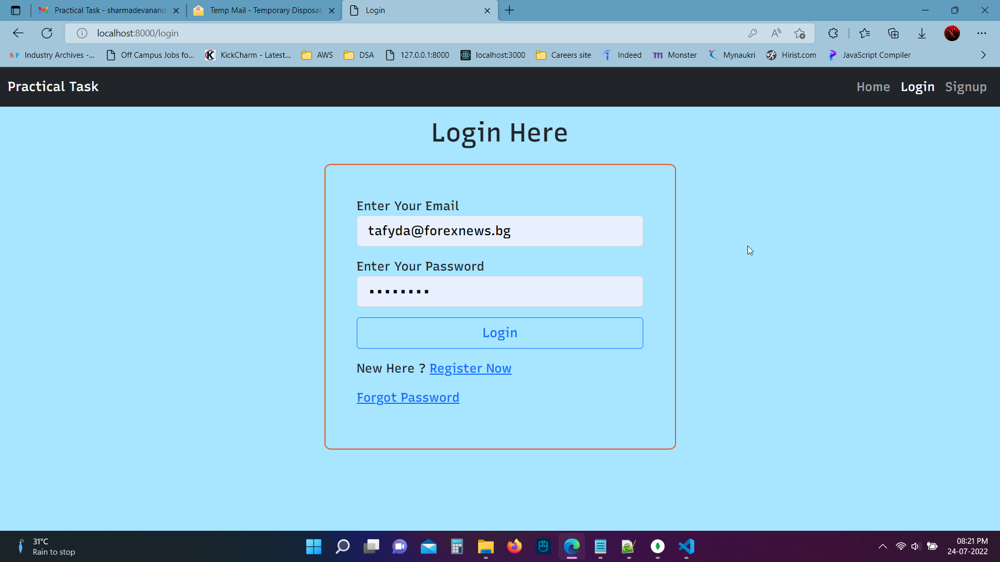
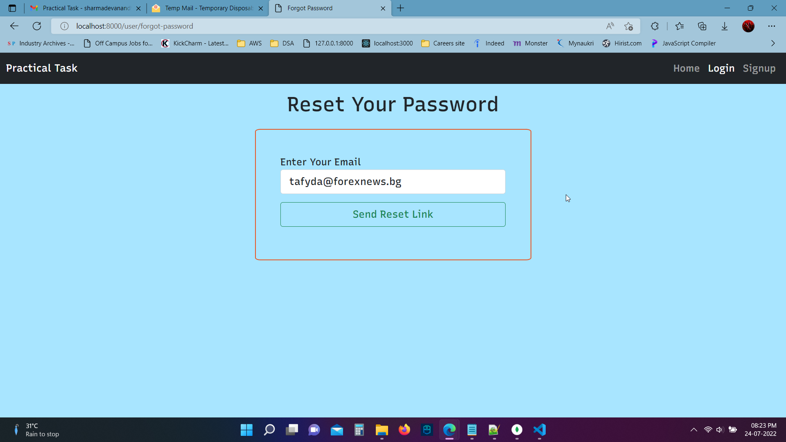
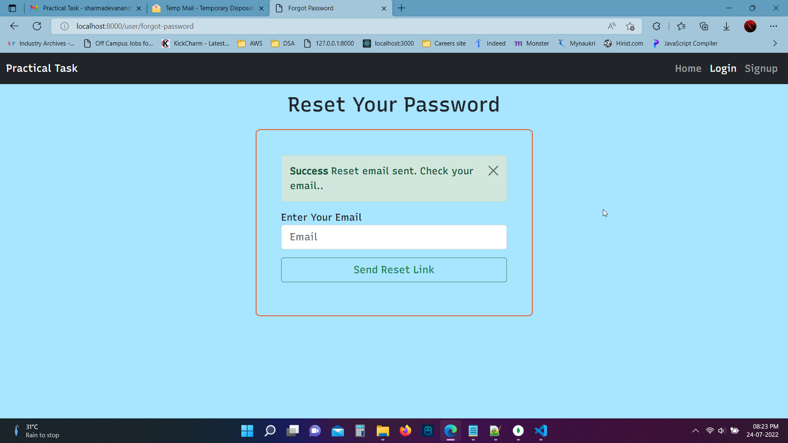

# Node Passport Authentication

## Functionality : Registration, Login, Password Reset, Account verification
## Modules used : passport, bcrypt, csrf token, nodemailer, mongoose, express

## To Run -> npm start
### ( Add mongoURI, google client ID and secret key, smtp config for sending emails )

## Screenshots :-

